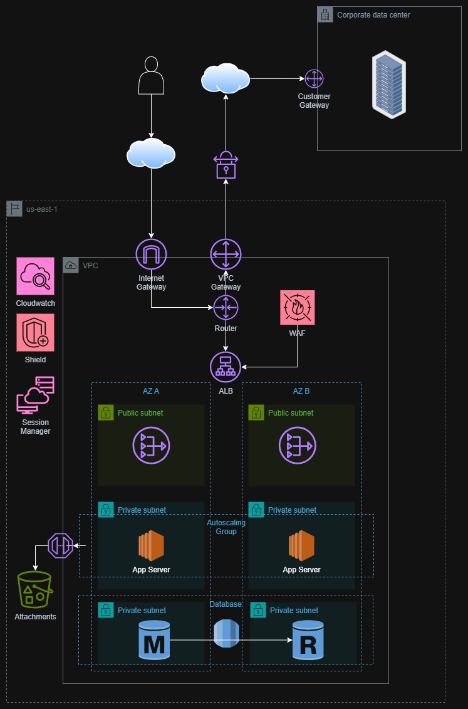

# Moodle High Availability Architecture

This repository documents the High Availability (HA) architecture for Moodle hosted on AWS. The infrastructure is designed to ensure fault tolerance, scalability, and security.

## Architecture Diagram

## Architecture Overview

The solution adheres to AWS best practices for high availability and security, utilizing a Multi-AZ (Availability Zone) strategy within the `us-east-1` region.

### 1. Networking & Connectivity
- **VPC (Virtual Private Cloud)**: Isolates the Moodle infrastructure.
- **Availability Zones**: The architecture spans **2 Availability Zones (AZ A and AZ B)** to ensure resilience against data center failures.
- **Subnets**:
  - **Public Subnets**: Host public-facing resources like the Load Balancer.
  - **Private Subnets (App Layer)**: Host the Moodle Application Servers, isolated from direct internet access.
  - **Private Subnets (Data Layer)**: Host the Database instances for maximum security.
- **Gateways**:
  - **Internet Gateway**: Allows public traffic to reach the ALB.
  - **Customer Gateway / VPC Gateway**: Facilitates secure VPN/Direct Connect connectivity to the Corporate Data Center.

### 2. Traffic Management & Security
- **Application Load Balancer (ALB)**: Distributes incoming traffic across healthy Moodle application servers in both Availability Zones.
- **AWS WAF (Web Application Firewall)**: Protects the application from common web exploits and bots.
- **AWS Shield**: Provides DDoS protection.
- **Security Groups**: Act as virtual firewalls to control traffic for each component.

### 3. Compute (Application Layer)
- **Auto Scaling Group**: Automatically adjusts the number of EC2 instances (App Servers) based on traffic load. It ensures there is always a healthy instance running in each AZ.
- **App Servers**: EC2 instances running the Moodle application code.

### 4. Data Storage & Database
- **Amazon RDS (Relational Database Service)**:
  - **Primary (Master)**: Handles write operations (located in AZ A).
  - **Standby (Replica)**: Synchronous replica in AZ B for automatic failover.
- **Amazon S3 (Simple Storage Service)**: Stores Moodle data `moodledata` (course files, user uploads, attachments) ensuring durability and shared access for all app servers.

### 5. Management & Monitoring
- **Amazon CloudWatch**: Monitors performance metrics, logs, and alarms.
- **AWS Systems Manager (Session Manager)**: Provides secure, password-less shell access to instances without opening inbound ssh ports.
